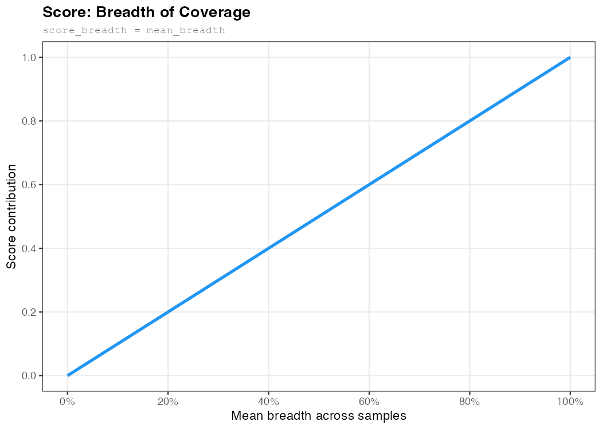
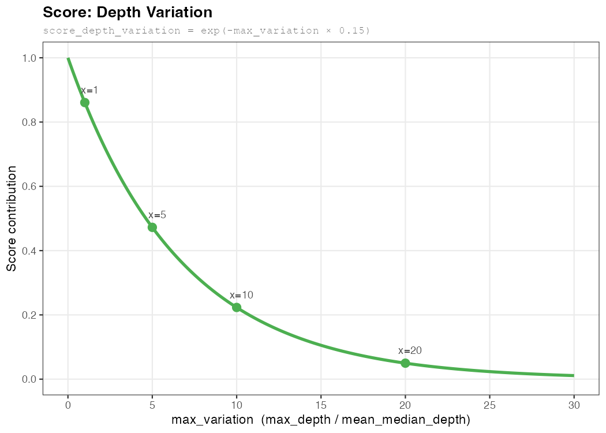

# SCG Determination

The pastForward Dynamics pipeline normalises TE and feature-library coverage against a set of **single-copy genes (SCGs)**. This document explains how those SCGs are determined automatically when no user-provided SCG FASTA is present.

## Overview

When `pipeline.dynamics.scg_selector.execute: true` is set and no FASTA file is found in `{species}/raw/dynamics/scg/`, pastForward runs the SCG determination pipeline automatically. The result — a ranked list and a filtered FASTA of the top-scoring SCGs — is placed in `{species}/results/dynamics/scg/` and fed directly into the Dynamics mapping step.

If a FASTA is provided in `{species}/raw/dynamics/scg/`, this step is skipped entirely and the user-supplied file is used.

See [config/README.md](../config/README.md) for all configuration options (`lineage`, `num_top_scgs`, `min_length_scg`, `max_length_scg`, etc.).

---

## Why Not Just Use BUSCO Directly?

The naïve approach — using every gene BUSCO calls "Complete" — is insufficient for aDNA work. BUSCO operates on a polished modern assembly under ideal conditions and says nothing about how a gene behaves when short, degraded ancient reads are mapped onto it. The three-step pipeline below forces each candidate SCG to earn its place empirically.

---

## Step 1 — Identify Candidate SCGs via BUSCO

BUSCO is run against the species reference genome using the configured lineage database (e.g. `drosophilidae_odb12`). Genes marked **Complete** and single-copy are extracted as nucleotide sequences using the genomic coordinates in BUSCO's `full_table.tsv`.

Two length filters are applied at this stage:

| Parameter | Default | Purpose |
|---|---|---|
| `min_length_scg` | 4,000 bp | Exclude genes too short to yield reliable coverage estimates |
| `max_length_scg` | 8,000 bp | Exclude very long genes that increase mapping runtime without benefit |

The result is a FASTA library (`{species}/processed/dynamics/scg/{species}_scg_library.fasta`) used in Step 2.

---

## Step 2 — Map Reads and Compute Per-SCG Coverage Statistics

Per-individual merged reads (`reads_merged/{individual}.fastq.gz`) are mapped to the SCG library. After removing unmapped reads, the following statistics are computed per SCG per individual using `pysam.count_coverage()`:

| Metric | Description |
|---|---|
| **Min depth** | Minimum read depth at any position |
| **Average depth** | Mean read depth across all positions |
| **Median depth** | Median read depth across all positions |
| **Max depth** | Peak pile-up at any single position |
| **Covered bases** | Number of positions with depth > 0 |
| **Breadth** | Fraction of positions covered by ≥ 1 read (`covered_bases / length`) |

> `count_coverage()` counts per-base observations (A/C/G/T) rather than spanning reads. Reads with a deletion at a given position contribute 0 depth there — marginally different from `samtools depth`, but negligible for coverage estimation.

Stats are stored as per-individual JSON files in `{species}/processed/dynamics/scg/stats/`. The mapping BAMs are marked temporary and deleted once statistics are written.

---

## Step 3 — Score and Rank SCGs

`determine_scg_ranking.py` aggregates statistics across all individuals and scores each SCG on three jointly penalised criteria. SCGs are then ranked in descending order; the top `num_top_scgs` are written to the filtered FASTA used by the Dynamics pipeline.

### Per-individual coverage normalisation

Individuals in a dataset are rarely sequenced to the same depth. Comparing raw depths across a 2× and a 30× sample would distort every metric: the high-coverage individual would dominate peak values, and mean depths would be meaningless averages of incompatible scales.

Before scoring, each individual's sequencing depth is accounted for by computing a **per-individual baseline** — the median depth across all candidate SCGs for that individual:

```
baseline_i = median(scg_median_depth for all SCGs, individual i)
```

Each SCG's depth is then expressed as a **depth ratio** relative to that baseline:

```
depth_ratio_i = scg_median_depth_i / baseline_i
```

A depth ratio of 1.0 means the SCG is covered exactly as expected for that individual's overall sequencing depth. All depth-based metrics used in scoring are computed from these ratios, making them comparable across individuals regardless of absolute coverage level.

The baseline uses the **median** deliberately. If a handful of multi-copy genes slip through BUSCO, their elevated depths cannot pull the baseline upward — the single-copy majority anchors it. As a result, true SCGs cluster at a ratio of ~1.0, while multi-copy genes sit above it (a 2-copy gene yields a ratio of ~2.0) and are penalised accordingly.

---

### Breadth of coverage (`score_breadth`)

Mean breadth across all individuals. A gene that is not reliably covered along its full length is not useful for normalisation, regardless of how deep the covered portion is.



### Depth variation (`score_depth_variation`)

Penalises uneven depth within a gene. `max_variation` is computed in normalised space: each individual's peak depth is first divided by that individual's baseline, and the worst such value across individuals is divided by the mean depth ratio:

```
max_variation         = max(max_depth_i / baseline_i) / mean_depth_ratio
score_depth_variation = exp(−max_variation × 0.15)
```

Previously `max_variation` used raw depths, so a single high-coverage individual could inflate the peak for every SCG. The normalised form isolates genuine within-gene pile-ups from between-individual coverage differences.

A true SCG should have relatively uniform depth. Genes with extreme local pile-ups — caused by repetitive elements (e.g. microsatellite tracts in introns), alignment artefacts, or paralogs missed by BUSCO — are downranked harshly.



Example of a microsatellite in a BUSCO gene that would be downranked by this criterion:


*Coverage profile showing microsatellite pile-up (teplotter)*


*Same locus in IGV*

### Depth consistency (`score_depth_consistency`)

Penalises SCGs whose normalised depth deviates from the expected value of **1.0**. After per-individual normalisation, true SCGs cluster at 1.0 by construction; multi-copy genes sit above it. The MAD of all SCGs' `mean_depth_ratio` values — computed relative to 1.0 — calibrates the scale of the penalty:

```
depth_deviation         = |mean_depth_ratio − 1.0| / (MAD_ratio + ε)
score_depth_consistency = exp(−depth_deviation / 4)
```

The reference is fixed at 1.0 rather than derived from the data, because the per-individual normalisation already guarantees that the true SCG majority clusters there. The MAD remains data-derived so the penalty scale adapts to the actual spread in the dataset. A `depth_deviation` of 1 means the SCG sits one MAD from 1.0; a value of 5 marks a clear outlier.

SCGs that are consistently over-represented relative to the bulk are likely not truly single-copy in practice (copy number variants, paralogs, or BUSCO misclassifications). The closer a gene clusters to 1.0, the more reliable it is as a normaliser.


### Final score

```
score = score_breadth + score_depth_variation + score_depth_consistency
```

`score_breadth` and `score_depth_variation` evaluate each SCG individually; `score_depth_consistency` evaluates it relative to the full SCG population.

---

## Outputs

| Path | Description |
|---|---|
| `{species}/results/dynamics/scg/{species}_scg_ranked.tsv` | Full ranked table with all scoring components; `mean_depth_ratio` column is the per-individual-normalised depth (1.0 = expected SCG level) |
| `{species}/results/dynamics/scg/{species}_scg_ranked.json` | Detailed JSON with per-individual raw stats, per-individual baselines, depth ratios, and scoring breakdown; `global_stats.individual_baselines` records each sample's normalisation baseline |
| `{species}/processed/dynamics/scg/{species}_relevant_scg.fasta` | Top-ranked SCG sequences passed to the Dynamics mapping step |
| `{species}/processed/dynamics/scg/{species}_relevant_scg.txt` | Plain list of retained SCG IDs |
| `{species}/processed/dynamics/scg/{species}_relevant_scg.bed` | BED file of retained SCG regions |
